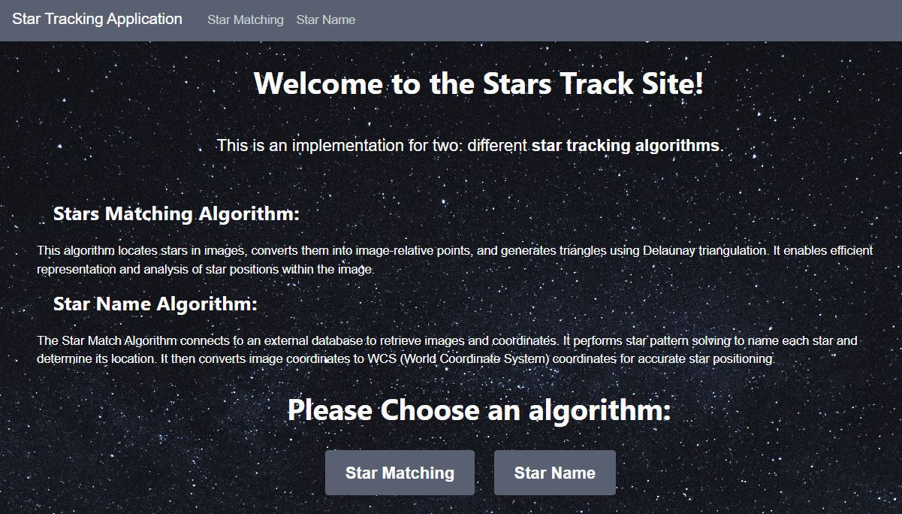
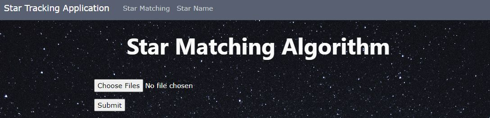
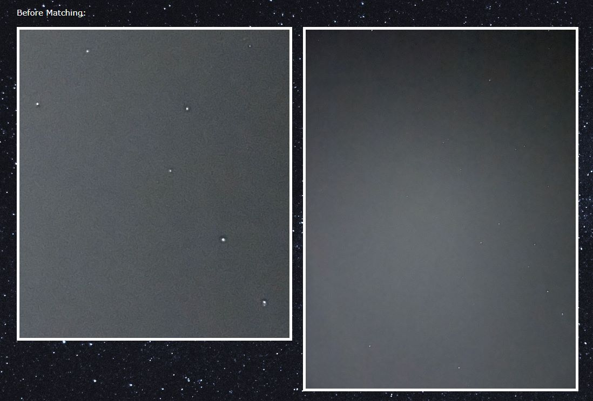
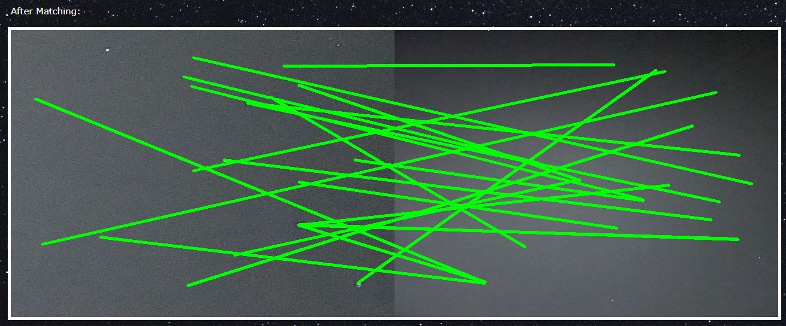
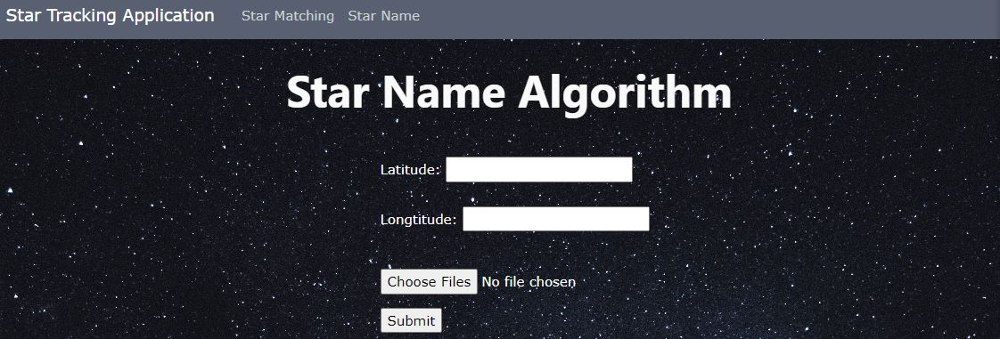
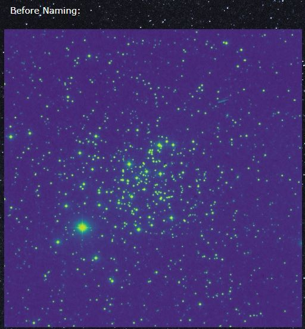
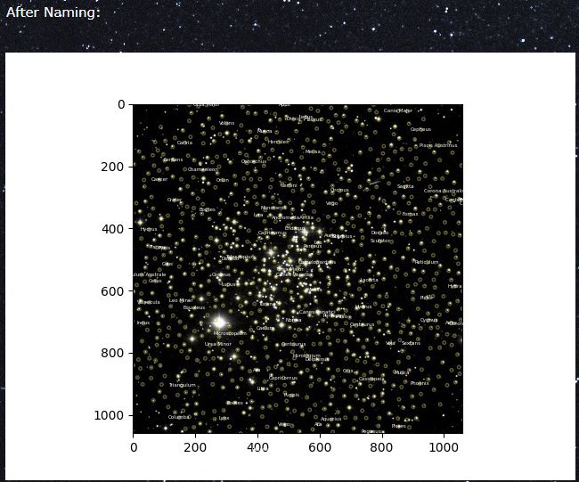

# Star Imaging and Star Naming
Authors:
Yuval Ben Yaakov,
Amit Kubani,
Reut Hadad.

# Introduction

-  in the vast expanse of space, accurate orientation determination is crucial for the success of spacecraft and satellites. A star tracker is an optical device that plays a pivotal role in this process by capturing star images and analyzing them to calculate the spacecraft's attitude.

-   We built a website that performs the main tasks that a star detector is required to do: star matching and star naming

## Implementation
*Star Naming:* 

we have implemented a plate solver with twirl which is an open source python library for implementing your own plate solver, and querying to SIMBAD catalogue for detecting the stars names.

*Star Matching:* 

another feature we implemented was star matching between 2 images, which uses Delauny's triangulation algorithm.

## How to use

1.  clone the repository and install all required dependencies.
2.  run the app:
   ``` Flask run ``` and follow the link on terminal.
4.  choose either star-matching or star-naming options, insert the required fields and click on results button.

## Main Functionality
### HomePage Screen:

On the opening screen there is an introduction about the site and a brief explanation of its functionality. The user will be able to choose between the option of accessing star matching or star tracking abilities.




### Star Matching Algorithm Screen:

Here the user is required to upload two pictures of stars for the purpose of matching.





### Star Naming Algorithm Screen:

On the second screen we upload a picture of stars of our choice and the location where the picture was taken. The algorithm emits a new image with the stars and their names by interfacing with the SIMBAD catalog.




#### Reasults
The output consists of identifying the stars with their names as follows.



## Link to Presentation

[Visit our project presentation](https://www.canva.com/design/DAFnwGnkfFM/7wUt8zkoAonnkTcR5WQy7w/view?utm_content=DAFnwGnkfFM&utm_campaign=designshare&utm_medium=link&utm_source=publishsharelink)
